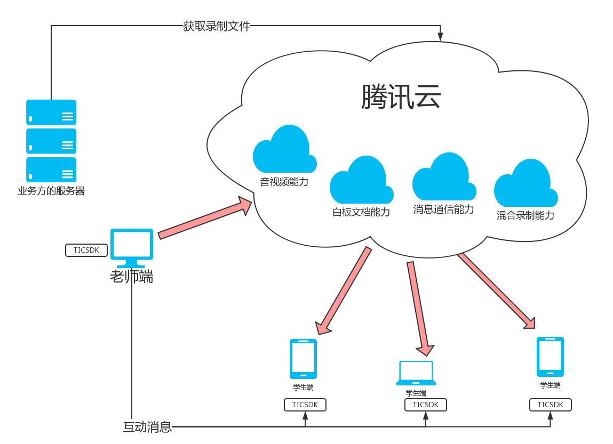

# 腾讯云互动课堂---教育解决方案
* 集实时音视频、互动白板、IM聊天室、文档转码、屏幕和媒体分享等功能的一站式在线教育互动课堂解决方案
* 基于教育场景提供统一的**TIC SDK**，整合了音视频能力（iLiveSDK），白板文档能力（boardSDK,COSSDK）极大的降低用户的学习成本。
* 提供录制后台服务，以restAPI的形式 获取课堂的录制视频

## 各端体验地址：

[PC v1.2.0](http://dldir1.qq.com/hudongzhibo/EDU/pc/EDU_PC_DEMO_1.2.0.zip)

[iOS v1.2.0](https://www.pgyer.com/0WzL)

[Android v1.2.0](http://dldir1.qq.com/hudongzhibo/EDU/android/edu_android_1.2.0.apk)

[Web 1.2.0](https://sxb.qcloud.com/web-edu/index.html)

### PC DEMO 运行界面图

## 互动课堂SDK（TIC SDK框图）
TICSDK融合了互动视频、云通讯（IMSDK、COS服务、电子白板等腾讯云服务。用户只需要实现自己的课堂业务。

**TIC SDK**主要提供以下能力：

1.音视频互动；

2.供文档存储、转码和展示能力；

3.提供课堂间文字互动能力；

4.录制服务提供课堂音视频+白板录制能力；

在TIC SDK基础上，用户只需要关心纯业务性的课堂开发，例如界面布局开发、人员管理、课堂管理、成员状态管理，权限管理以及文字互动消息的展示等。

通过**TIC SDK**，可以简化用户使用以上能力的流程，减低用户进行各SDK接入的学习成本。

## TIC SDK类图
主要类图如下，使用很简单，主要使用绿色的管理类就好了。一个代表音视频消息能力，一个代表白板文档能力。

主要业务接口有**TICManager**和白板SDK的**WhiteboardManager**，**WhiteboardView**为白板数据视图控件；

**TICManager**提供简单的课堂管理，如课堂资源申请和销毁，AV房间的互动（如摄像头、麦克风设备开关、文字互动以及屏幕分享和播片等互动）；

**WhiteboardManager**主要是白板业务的管理，如白板绘制、撤销、重做等，PC以及Web端还提供了展示课堂文档（存储、转码及展示）等服务。

另外，用户还可以直接通过**iLiveSDK**的业务接口，对课堂进行更细粒度的互动控制。
