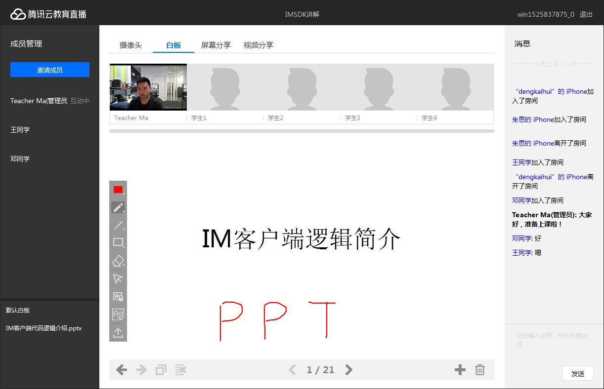

# 腾讯云互动课堂---教育解决方案
* 集实时音视频、互动白板、IM聊天室、文档转码、屏幕和媒体分享等功能的一站式在线教育互动课堂解决方案
* 基于教育场景提供统一的TICSDK，整合了音视频能力（iLiveSDK），白板文档能力（boardSDK,COSSDK）极大的降低用户的学习成本。
* 提供录制后台服务，以restAPI的形式 获取课堂的录制视频

## PC DEMO 界面图

* **框架文档**：TIC服务整体框架说明，助您更好的理解TIC整体服务能力；
* **SDK接口文档**：各端集成TIC服务SDK教程文档，包括Android、iOS、Web和Windows（小程序还在开发中）
* **后台录制协议文档**：TIC录制服务说明文档。

