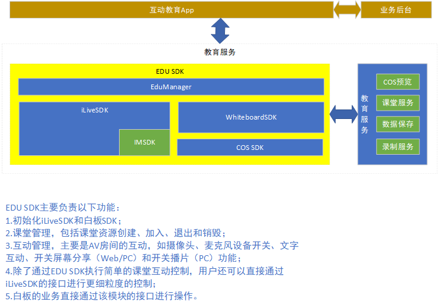
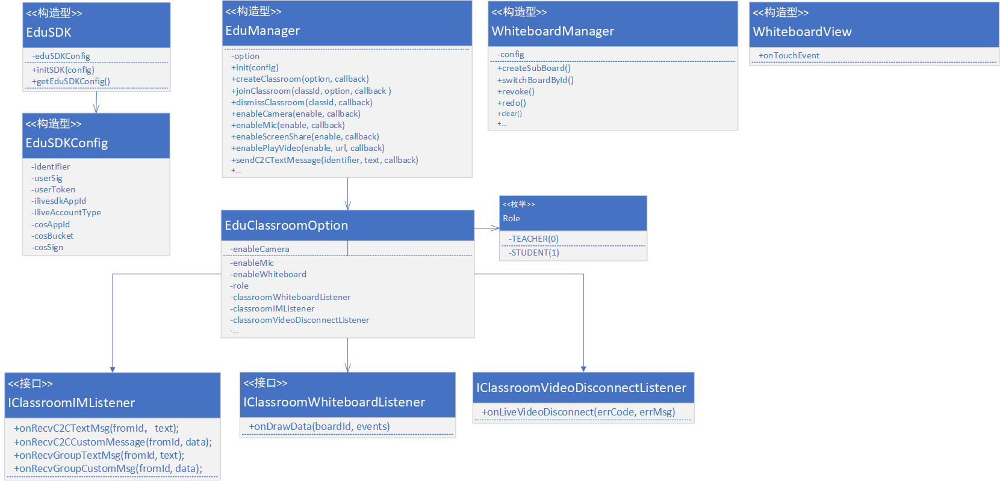

# 教育服务SDK接口文档

## 背景
为打造腾讯课堂一体化接入方案，在满足多种场景需求的前提下，简化客户接入流程，提高接入效率，给客户提供最好的服务体验。在现有的腾讯互动视频、云通讯和COS服务能力的基础上，构建简单好用的的互动教育服务。


## 关键字
* 课堂：Classroom
* 白板：Whiteboard
* 教育SDK：EduSDK


## 结构框图 

如下：



## 主要接口

| 类                  	| 说明             |
| ------------------	| --------------- |
| EduSDKConfig     		|  教育SDK参数配置类 |
| EduSDK     			 	|  教育SDK总入口 	 |
| EduClassroomOption		|  课堂参数配置类 |
| EduManager    			|  教育SDK业务管理类 |
| WhiteboardManager    			|  白板业务管理类 |
| IClassroomIMListener | 课堂IM消息监听接口 |
| IClassroomWhiteboardListener | 课堂白板绘制数据回调监听接口|
| IClassroomVideoDisconnectListener | 互动视频流异常退出监听接口|


**关系类图如下：**


### EduSDKConfig
SDK参数配置类。主要是使用iLiveSDK、IM和COS服务所需的关键参数，需要由业务传入。主要如下：

| 主要配置项             |类型     			| 说明                |
| ------------------	| -------------	| ---------------    |
| identifier     		|	String 		|  IM用户id      |
| userSig     			| 	String			|  IM用户鉴权票据      |
| userToken     			| 	String			|  用户token      |
| iLiveSDKAppId     	|	int	 			|  iLiveSDK的appId      |
| iLiveAccountType     	|	int	 			|  iLiveSDK的账号类型      |
| cosAppId     			| 	int				|  COS服务的appId      |
| bucket    			 	|	String			|  COS中用于存储数据的容器      |
| sign    			 	|	String			|  COS 签名信息，用于上传文件至COS服务器      |

```java
/**
     * IM用户id
     */
    private String identifier = null;
    /**
     * IM用户鉴权票据
     */
    private String userSig = null;

    /**
     * IM用户token
     */
    private String userToken;

    /**
     * https://cloud.tencent.com/document/product/269/1508
     * iLiveSDK的appId
     */
    private int ilivesdkAppid;
    /**
     * iLiveSDK的账号类型
     */
    private int iliveAccountType;
    /**
     * COS服务的appId（见https://cloud.tencent.com/document/product/436/7751）
     */
    private int cosAppId;

    /**
     * COS中用于存储数据的容器
     */
    private String bucket = null;

    /**
     * COS 签名信息，用于上传文件至COS服务器
     */
    private String sign = null;

```


### EduSDK
EduSDK是使用教育服务SDK的总入口，主要服务SDK的初始化工作，主要接口如下：

| 主要方法                  	| 说明             |
| ------------------	| ---------------       |
| initSDK()     			 	|  教育SDK总入口      |
| getVersion    			|  获取版本信息     |

```java
/**
     * 教育SDK初始化
     * @param config 初始化配置参数
     * @return
     */
    private int initSDK(EduSDKConfig config, ...) {
        eduSDKConfig = config;
        // TODO: 2018/4/27 调用EduManager进行初始化
        return 0;
    }
```

### EduClassroomOption
课堂参数配置类，主要是用于创建课堂或者加入课堂时的参数配置，可用于配置是否开启音视频、白板等功能；暂时定义如下（还不够完整，需要持续更新）：

| 主要配置项             |类型     			| 说明                |
| ------------------	| -------------	| ---------------    |
| enableCamera     		|	boolean 		|  开启摄像头，默认fasle，不开启      |
| enableMic     			| 	boolean		|  开启麦克风，默认false，不开启      |
| enableWhiteboard		| 	boolean		|  开启白板，默认true，开启      |
| classroomWhiteboardListener     	|	IClassroomWhiteboardListener|  课堂白板绘制事件回调 |
| classroomIMListener     	|	IClassroomIMListener|  课堂文字互动消息事件回调 |
| classroomVideoDisconnectListener     		| IClassroomVideoDisconnectListener			|  互动视频流异常退出监听      |

回调接口定义如下：

| 接口             |回调方法     			| 说明                |
| ------------------	| -------------	| ---------------    |
| **IClassroomIMListener**     	|onRecvC2CTextMsg |  收到C2C文本消息      |
|     	| 	onRecvC2CCustomMsg		|  收到C2C自定义消息      |
|		| 	onRecvGroupTextMsg		|  开启白板，默认true，开启      |
|     	|	onRecvGroupCustomMsg|  收到Group文本消息 |
| **IClassroomWhiteboardListener**  |onDrawData|  白板绘制事件回调 |
| **IClassroomVideoDisconnectListener**  |onLiveVideoDisconnect|  视频流异常退出 |


### EduManager
课堂业务管理类，负责课堂管理和课堂互动管理等主要业务。主要业务接口如下：

| 主要接口                  	| 说明（括号里标识改接口为某端特有）             |
| ------------------	| ---------------       |
| init     			 	|  初始化      |
| createClassroom    			|  创建课堂    |
| joinClassroom    			|  加入互动课堂    |
| dismissClassroom    			|  解散课堂（老师下课，后台会回收改课堂资源）    |
| quitClassroom    			| 中途退出课堂，可重新进入    |
| enableCamera    			|  打开/关闭摄像头    |
| switchCamera    			|  前后摄像头切换    |
| enableMic    			|  打开/关闭麦克风    |
| switchMic    			|  切换麦克风    |
| enableScreenShare    			|  开启/关闭屏幕分享（PC && Web）    |
| enablePlayVideo    			|  开启/关闭播片功能（PC）    |
| setAvRootView    			|  设置渲染控件(Android)    |
| sendC2CTextMessage    			|  发送C2C文本消息    |
| sendC2CCustomMessage    			|  发送C2C自定义消息    |
| sendGroupTextMessage    			|  发送群文本消息    |
| sendGroupCustomMessage    			|  发送群组自定义消息    |

详细说明如下（@NonNull标识该参数不可为空；@Nullable标识该参数可以为空）：

```java

	public int init(@NonNull  EduSDKConfig config) {
        // TODO: 2018/4/27 登陆IM, 初始化ilivesdk
        return 0;
    }

    /**
     * 根据参数创建课堂
     *
     * @param classroomOpion 创建课堂的配置参数，详见@EduClassroomOpion
     * @param callback       回调，见@IEduCallback， onSuccess，携带课堂id标识，该标识很重要，唯一标识课堂资源，业务方需要结合自己的业务维护该资源。若出错，则通过onError返回。
     */
    public void createClassroom(@NonNull final EduClassroomOpion classroomOpion, @NonNull final ILiveCallBack<String> callback);

    /**
     * 根据参数配置和课堂id加入互动课堂中
     *
     * @param classId  课堂id标识，由createClassroom接口统一创建和分配。见@EduSDK#createClassroom
     * @param callback 回调
     */
    public void joinClassroom(@NonNull final String classId, @NonNull final EduClassroomOpion classroomOpion, @Nullable final ILiveCallBack callback);
    }

    /**
     * 解散课堂（老师下课，后台会回收改课堂资源）
     *
     * @param classId
     * @param callback
     */
    public void dismissClassroom(@NonNull final String classId, @Nullable final ILiveCallBack callback);

    /**
     * 中途退出课堂，可重新进入
     *
     * @param classId  课堂id
     * @param callback 回调
     */
    public void quitClassroom(@NonNull final String classId, @Nullable final ILiveCallBack callback);

    /**
     * 打开/关闭摄像头
     * @param enable   true：打开摄像头，默认开启前置摄像头；false：关闭
     * @param callback 回调
     */
    public void enableCamera(final boolean enable, @Nullable final ILiveCallBack callback);

    /**
     * 前后摄像头切换
     * @param cameraId 摄像头设备标识
     * @param callback 回调
     */
    public void switchCamera(final int cameraId, @Nullable final ILiveCallBack callback);

    /**
     * 打开/关闭麦克风
     *
     * @param enable   enable true：打开；false：关闭
     * @param callback 回调
     */
    public void enableMic(final boolean enable, @Nullable final ILiveCallBack callback);

    /**
     * 切换麦克风
     * @param deviceId
     * @param callBack
     */
    public void switchMic(final int deviceId, @Nullable final ILiveCallBack callBack);

    /**
     * 开启/关闭屏幕分享
     * @param enable， true，开启；false，关闭
     * @param callBack 回调
     */
    public void enableScreenShare(final boolean enable, @Nullable final ILiveCallBack callBack);

    /**
     * 开启/关闭播片功能
     * @param enable  true，开启；false，关闭
     * @param url 待定
     * @param callBack 回调
     */
    public void enablePlayVideo(final boolean enable, @Nullable final String url, @Nullable final ILiveCallBack callBack);

    /**
     * 设置渲染控件
     * @param avRootView iLiveSDK视频渲染控件，视频渲染详见https://github.com/zhaoyang21cn/iLiveSDK_Android_Suixinbo/blob/master/doc/ILiveSDK/AndroidRenderIntr.md
     */
    public void setAvRootView(AVRootView avRootView);

    /**
     * 发送C2C文本消息
     * @param identifier 消息接收者
     * @param text 发送内容
     * @param callBack 回调
     */
    public void sendC2CTextMessage(@NonNull final String identifier, @NonNull final String text, @Nullable final ILiveCallBack callBack);

    /**
     * 发送C2C自定义消息
     * @param identifier 消息接收者
     * @param data 发送的自定义的内容
     * @param callBack 回调
     */
    public void sendC2CCustomMessage(@NonNull final String identifier, @NonNull final byte[] data, @Nullable final ILiveCallBack callBack);

    /**
     * 发送群文本消息
     * @param text 发送的群组消息内容
     * @param callBack 回调
     */
    public void sendGroupTextMessage(@NonNull final String text, @Nullable final ILiveCallBack callBack);

    /**
     * 发送群组自定义消息
     * @param data 发送的自定义的群组消息内容
     * @param callBack 回调
     */
    public void sendGroupCustomMessage(@NonNull final byte[] data, @Nullable final ILiveCallBack callBack);
```    
    
## 白板管理
白板SDK的业务接口不通过EduManager传递，直接通过该模块的对外接口管理（如Android中的WhiteboardManager）对外暴露所有功能接口。
详见[《Android白板SDK使用手册》](http://git.code.oa.com/tomzhu/ConfSDKDoc/blob/master/%E6%8E%A5%E5%8F%A3%E6%96%87%E6%A1%A3/%E9%9B%86%E6%88%90%E6%96%87%E6%A1%A3/Android%E9%9B%86%E6%88%90%E6%96%87%E6%A1%A3/Android%E7%99%BD%E6%9D%BFSDK%E4%BD%BF%E7%94%A8%E6%89%8B%E5%86%8C.md)
	
## 同步白板历史消息
备份和恢复历史白板数据由EduSDK内部完成，不需对外暴露。