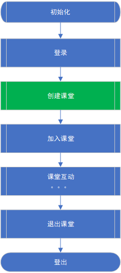

# 腾讯互动课堂SDK（TICSDK）集成使用文档
## 1. 简介
腾讯互动课堂（Tencent Interact Class，TIC）SDK 是一个提供在线教育场景下综合解决方案的 iOS 静态库，它对`ilivesdk`、`boardsdk`和`cosxml`等SDK进行了业务封装，提供了【多人音视频】，【多人即时通信】，【多人互动画板】【文档云端转码预览】等功能。适用于在线互动课堂，在线会议，你画我猜等场景。

> 注：由于在线课堂场景下老师主要在PC端进行操作，所以移动端TICSDK暂时不提供文档管理相关功能；

## 准备工作
TICSDK使用了互动视频服务（iLiveSDK）、云通讯服务（IMSDK）、COS服务等腾讯云服务能力，在使用腾讯互动课堂服务时，请对点时间了解以上服务的基本概念和基本业务流程。

[互动直播](https://cloud.tencent.com/document/product/268/8424)

[云通讯服务（IMSDK）](https://cloud.tencent.com/document/product/269/1504)

[COS服务](https://cloud.tencent.com/document/product/436/6225)

## 2. 集成SDK
TICSDK仅支持gradle的集成方式。

在build.gradle中的dependencies里添加以下依赖：

```
    compile 'com.tencent.qcloud:cosxml:5.4.4'
    compile 'com.tencent.ilivesdk:ilivesdk:1.8.6.0.5'
    compile 'com.tencent.ticsdk:ticsdk:0.0.1.3'
    compile 'com.tencent.boardsdk:boardsdk:1.2.3.1'
```    

并在defaultConfig中配置abiFilters信息
 
 ```
	defaultConfig {
   		...
		ndk {
			abiFilters 'armeabi', 'armeabi-v7a'
      }
    }
 ```	
 	

## 3. 使用SDK
### 3.1 头文件概览

先总体说明下SDK中暴露的公开头文件的主要功能：

类名 | 主要功能
--------- | ---------
TICSDK | 整个SDK的入口类，提供了SDK【初始化】以及【获取版本号】的方法
TICManager | 互动课堂管理类，互动课堂SDK对外主要接口类，提供了【添加白板】、【登录/登出SDK】、【创建/加入/销毁课堂】、【音视频操作】、【IM操作】等接口
TICClassroomOption | 加入课堂时的课堂配置类，主要用来配置加入课堂时的角色（学生 or 老师）、是否自动开启摄像头，麦克风等，另外课堂配置对象还带有两个可选的代理对象，一个是复制监听课堂内部事件，另一个则负责监听课堂内的IM消息
AVRootView | iLiveSDK视频显示控件
WhiteboardView | 白板控件

### 3.2 控件使用
TICSDK主要用到两个重要的UI控件，分别用于显示视频流信息和白板数据信息的。开发者可以直接使用或者集成，添加自己业务需要的特性。如Demo：

```xml
<com.tencent.ticsdk.demo.views.LivingVideoView
	android:id="@+id/av_root_view"
	android:layout_width="match_parent"
	android:layout_height="wrap_content" />

<com.tencent.boardsdk.board.WhiteboardView
	android:id="@+id/whiteboardview"
	android:layout_width="match_parent"
	android:layout_height="wrap_content"
	android:layout_alignParentTop="true"
	android:visibility="invisible" />
```
>其中LivingVideoView继承于AVRootView

**WhiteboardView控件仅支持款宽高比为16：9的比例显示。请开发者注意与设计师同步该信息，以及不要随意修改该比例，以免影响白板功能的正常体验。**

互动直播的AVRootView控件，构建出实例后，需要设置给TICSDK内部，如：

```java
	LivingVideoView livingVideoView = (LivingVideoView) findViewById(R.id.av_root_view);
	TICManager.getInstance().setAvRootView(livingVideoView);
```
关于AVRootView更多使用，请参考
[Android渲染指引文档](https://github.com/zhaoyang21cn/iLiveSDK_Android_Suixinbo/blob/master/doc/ILiveSDK/AndroidRenderIntr.md)

### 3.3 TICSDK业务流程

TICSDK使用的一般流程如下：

 


 > 其中【创建课堂】为教师角色特有流程，学生角色不需调用。

下面将SDK按照功能划分，遵循一般的使用顺序，介绍一下`TICSDK`中各功能的使用方法和注意点:

### 3.4 初始化SDK
要使用`TICSDK`，首先得进行初始化，初始化方法位于`TICSDK`单例类中：

```java
    > TICSDK.java(接口所在类，下同)
    /**
     * 教育SDK初始化
     *
     * @param context
     * @param appId       iLiveSDK appId
     * @param accountType iLiveSDK accountType
     */
    public void initSDK(Context context, int appId, int accountType);

```
初始化方法很简单，开发者在Application组件中的onCreate调用初始化接口即可。但是开发者在初始化之前必须保证已经在[腾讯云后台](https://console.cloud.tencent.com/rav)注册成功，并创建了应用，这样才能拿到腾讯云后台分配的SDKAppID和accountType。

> 如果开发者App中用到了多进程，初始化时需要注意避免重复初始化，如下：

```

if (主进程) {    
	// 仅在主线程初始化
	TICSDK.getInstance().initSDK(this, Constants.APPID, Constants.ACCOUNTTYPE);
}

```


### 3.5 登录/登出
初始化完成之后，因为涉及到IM消息的收发，所以还必须先登录：

```java
    > TICManager.java
    /**
     * IM登陆
     *
     * @param identifier IM用户id
     * @param userSig    IM用户鉴权票据
     * @param callBack   回调
     */
    public void login(final String identifier, final String userSig, final ILiveCallBack callBack);
```
该方法需要传入两个参数，identifier和userSig，identifier为用户ID，userSig为腾讯云后台用来鉴权的用户签名，相当于登录TICSDK的用户密码，由腾讯云后台生成，登录的流程如下：


终端先以开发者的账号体系登录自己的服务器，然后再由开发者服务器调用腾讯云后台API，来为每一个开发者已有的账号生成对应的userSig，终端拿到userSig之后再调用该登录方法登录TICSDK。

该流程基于腾讯云通信账号集成的独立模式，详见[官方文档](https://cloud.tencent.com/document/product/269/1508)。

当然，在开发调试阶段，用户可以在自己的腾讯云应用控制台使用开发辅助工具，来生成临时的uid和userSig用于开发测试


> 注意：
> 1. 如果此用户在其他终端被踢，登录将会失败，返回错误码（ERR_IMSDK_KICKED_BY_OTHERS：6208）。开发者必须进行登录错误码 ERR_IMSDK_KICKED_BY_OTHERS 的判断。
> 2. 如果用户保存用户票据，可能会存在过期的情况，如果用户票据过期，login 将会返回 70001 错误码，开发者可根据错误码进行票据更换。
> 3. 关于以上错误的详细描述，参见[用户状态变更](https://cloud.tencent.com/document/product/269/9148#.E7.94.A8.E6.88.B7.E7.8A.B6.E6.80.81.E5.8F.98.E6.9B.B4)。


登出方法比较简单，如下：

```java
    > TICManager.java
    /**
     * 注销登陆
     *
     * @param callBack 注销登录结果回调
     */
    public void logout(final ILiveCallBack callBack);
```

### 3.6 课堂管理

* 创建课堂

登录成功之后，就可以创建或者加入课堂了，创建课堂接口如下，创建成功会在成功回调中返回创建课堂的 classID（classID是一个课堂的唯一标识）：

```java
    > TICManager.java
    /**
     * 根据参数创建课堂
     * @param roomId 房间ID，有业务生成和维护。
     * @param callback 回调，见@ILiveCallBack， onSuccess，创建成功；若出错，则通过onError返回。
     */
    public void createClassroom(final int roomId, final ILiveCallBack callback) {
```

创建课堂接口，只是向腾讯云互动课堂后台申请了一个课堂ID，并进行了一些准备工作，老师端创建课堂后还需调用`加入课堂`方法加入课堂。

* 加入课堂

```java
    > TICManager.java
    /**
     * 根据参数配置和课堂id加入互动课堂中
     *
     * @param option   加入课堂参数选项。见@{TICClassroomOption}
     * @param callback 回调
     */
    public void joinClassroom(@NonNull final TICClassroomOption option, final ILiveCallBack callback);
```

该接口需要传入房间id，该id由开发者生成和维护，可参考TICSDK提供的业务服务器Demo代码生成。

```java
    > TICClassroomOption.java
    /**
     * 课堂角色
     */
    public enum Role {
        /**
         * 老师
         */
        TEACHER(0),
        /**
         * 学生
         */
        STUDENT(1);
        private int value;

        Role(int value) {
            this.value = value;
        }

        public int getValue() {
            return value;
        }
    }

    /**
     * 房间ID，由业务维护
     */
    private int roomId;
    /**
     * 开启摄像头
     */
    private boolean enableCamera = false;

    /**
     * 开启Mic
     */
    private boolean enableMic = false;

    /**
     * 默认开启白板
     */
    private boolean enableWhiteboard = true;

    /**
     * 课堂角色，默认是学生角色，见@Role
     */
    private Role role = Role.STUDENT;

    /**
     * 课堂白板绘制事件回调
     */
    //private IClassroomWhiteboardListener classroomWhiteboardListener;

    /**
     * 课堂文字互动消息事件回调
     */
    private IClassroomIMListener classroomIMListener;

    /**
     * 课堂音视频异常断开/IM群组解散
     */
    private IClassEventListener classEventListener;d
```

**TICClassroomOption**加入课堂配置类集成iLiveSDK的**ILiveRoomOption**，在此基础上新增些开关和回调接口，如：加入课堂时的角色（老师或学生，一般创建课堂的人为老师，其他人应该以学生身份加入课堂），以及进入课堂时是否自动开启摄像头和麦克风（一般情况下， 老师端进入课堂默认打开摄像头和麦克风，学生端进入课堂默认关系）。

开发者亦可通过该参数直接控制iLiveSDK的进房参数设置。

* 退出课堂

```java
    > TICManager.java
    /**
     * 退出课堂，退出iLiveSDK的AV房间，学生角色退出群聊和白板通道群组；老师角色则解散这两个群组
     *
     * @param callback 回调
     */
    public void quitClassroom(final ILiveCallBack callback) {
```

学生退出课堂时，只是本人退出了课堂，老师调用`退出课堂`方法退出课堂时，该课堂将会被销毁，另外退出课堂成功后，可能内的资源将会被回收，所以开发者应尽量保证再加入另一个课堂前，已经退出了前一个课堂。

### 3.7 白板相关操作

白板的相关操作用户直接通过白板SDK操作即可，TICSDK不做任何封装。详见《Android白板SDK使用手册》。

TICSDK 中只有一个关于白板的接口，就是添加一个白板视图对象：后添加的为准），然后直接调用TXBoardView中的接口来操作白板即可，详见【TXBoardView白板SDK使用手册】。

### 3.8 IM相关操作

IM相关的接口封装于腾讯云通信SDK`IMSDK`，同样，TICSDK中也只封装了一些常用接口：

```java
    > TICManager.java
    /**
     * 发送C2C文本消息
     *
     * @param identifier 消息接收者
     * @param text       发送内容
     * @param callBack   回调
     */
    public void sendC2CTextMessage(final String identifier, final String text, final ILiveCallBack callBack) {
        ILiveTextMessage message = new ILiveTextMessage(text);
        ILiveRoomManager.getInstance().sendC2CMessage(identifier, message, callBack);
    }

    /**
     * 发送C2C自定义消息
     *
     * @param identifier 消息接收者
     * @param data       发送的自定义的内容
     * @param callBack   回调
     */
    public void sendC2CCustomMessage(final String identifier, final byte[] data, final ILiveCallBack callBack) {
        ILiveCustomMessage message = new ILiveCustomMessage(data, "");
        ILiveRoomManager.getInstance().sendC2CMessage(identifier, message, callBack);
    }

    /**
     * 发送群文本消息
     *
     * @param text     发送的群组消息内容
     * @param callBack 回调
     */
    public void sendGroupTextMessage(final String text, final ILiveCallBack callBack) {
        ILiveTextMessage message = new ILiveTextMessage(text);
        ILiveRoomManager.getInstance().sendGroupMessage(message, callBack);
    }

    /**
     * 发送群组自定义消息
     *
     * @param data     发送的自定义的群组消息内容
     * @param callBack 回调
     */
    public void sendGroupCustomMessage(@NonNull final byte[] data, final ILiveCallBack callBack) {
        ILiveCustomMessage message = new ILiveCustomMessage(data, "");
        ILiveRoomManager.getInstance().sendGroupMessage(message, callBack);
    }
```
课堂内成员在调用以上方法发送消息时，会触发IM事件，如果在加入课堂前设置了IM事件监听 `IClassroomIMListener classroomIMListener;`，一端发送IM消息时，另一端就可以在课堂内IM消息回调对应方法中得到通知:

```java
    > IClassroomIMListener.java
    /**
     * 收到C2C文本消息
     */
    void onRecvC2CTextMsg(String fromId, String text);

    /**
     * 收到C2C自定义消息
     */
    void onRecvC2CCustomMsg(String fromId, byte[] data);

    /**
     * 收到Group文本消息
     */
    void onRecvGroupTextMsg(String fromId, String text);

    /**
     * 收到Group自定义消息
     */
    void onRecvGroupCustomMsg(String fromId, byte[] data);
```

这4个接口方法，分别对应了前面4个消息发送的方法，对应类型的消息会在对应类型的代理方法中回调给课堂内所有成员（发消息本人除外），其他端收到后可以将消息展示在界面上。

### 3.9 音视频相关操作

这部分功能封装于腾讯云互动直播SDK `ILiveSDK`，TICSDK中只封装了一些常用的接口：打开/关闭摄像头、切换摄像头、打开/关闭麦克风、打开/关闭扬声器等，具体如下：

```java
    > TICManager.java
    /**
     * 打开/关闭摄像头
     *
     * @param cameraId 要打开或者关闭的摄像头设备标识，见@ILiveConstants.FRONT_CAMERA或ILiveConstants.BACK_CAMERA;
     * @param enable   true：打开摄像头，默认开启前置摄像头；false：关闭
     * @param callback 回调
     */
    public void enableCamera(int cameraId, final boolean enable, final ILiveCallBack callback);

	/**
     * 前后摄像头切换
     *
     * @param callback 回调
     */
    public void switchCamera(@Nullable final ILiveCallBack callback);
    
    /**
     * 打开/关闭麦克风
     *
     * @param enable   enable true：打开；false：关闭
     * @param callback 回调
     */
    public void enableMic(final boolean enable, final ILiveCallBack callback);
    
    /**
     * 打开/关闭扬声器
     *
     * @param enable   enable true：打开；false：关闭
     * @param callback
     */
    public void enableSpeaker(final boolean enable, final ILiveCallBack callback);
```

课堂内成员在进行打开/关闭摄像头、麦克风操作时，会触发音视频事件，iLiveSDK自动渲染到控件上。同时对AVRootView设置setSubCreatedListener事件监听，则会收到onSubViewCreated的回调。此时，开发者可以遍历AVRootView中的AVVideoView，对各视频流做展示处理。具体参考（待添加：iLiveSDK相关文档链接。）


### 3.10 课堂内其他事件监听

进入课堂的配置对象中的课堂事件监听接口的协议方法：

```java
    > IClassEventListener.java
    /**
     * 视频流异常退出
     * @param errCode
     * @param errMsg
     */
    void onLiveVideoDisconnect(int errCode, String errMsg);

    /**
     * 课堂解散通知
     */
    void onClassroomDestroy();
```

以上协议方法分别代表有人加入课堂，有人退出课堂和课堂被解散的回调，开发者可以根据自己的业务需求，对回调事件进行相应的处理，比如：在收到课堂解散回调时（老师退出课堂即触发该回调），课堂内的学生端可以弹出一个提示框，提示学生课堂已经结束。


## 4.常见问题
### 4.1.**AvRootView**与**WhiteboardView**叠加时白板无法显示。

AvRootView和WhiteboardView都是集成SurfaceView的，SurfaceView叠加显示时会有异常。
通过SurfaceView的setZOrderMediaOverlay(true);即可解决。

